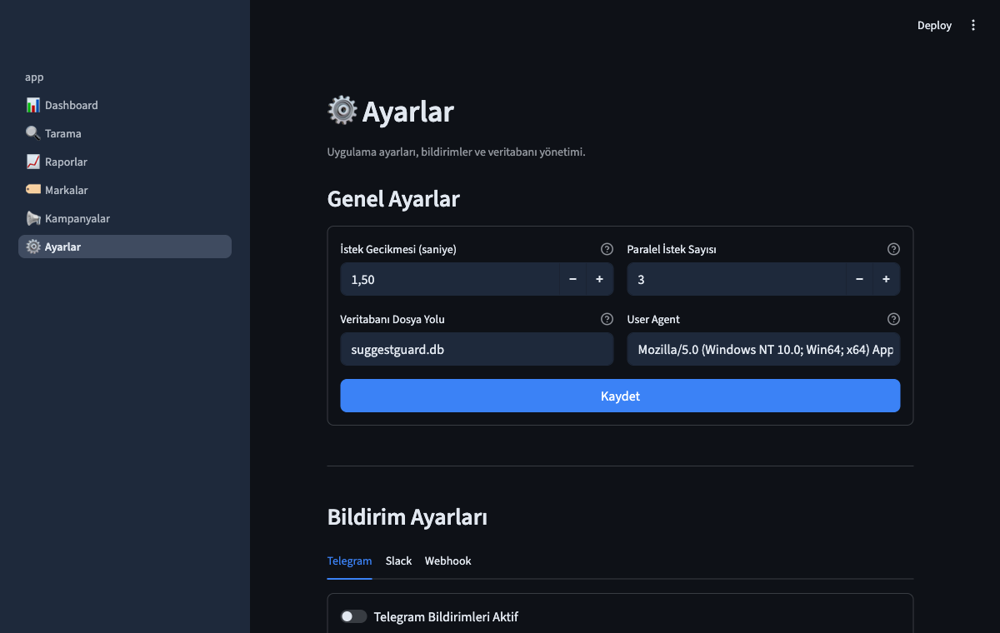

# SuggestGuard

**Google Autocomplete itibar izleme ve analiz platformu**

[](https://github.com/dermnx/suggestguard/actions/workflows/ci.yml)
[](https://www.python.org/downloads/)
[](LICENSE)
[](https://streamlit.io)
[](https://docs.astral.sh/ruff/)

Google arama önerilerinde markanız hakkında ne yazıldığını takip edin.
Negatif önerileri tespit edin, trendleri analiz edin ve itibar kampanyalarınızın
etkisini ölçün — tamamen Türkçe, tamamen ücretsiz.

---

## Quick Start

```bash
# Kurulum
pip install -e ".[dev]"

# Streamlit dashboard'u başlat
streamlit run suggestguard/ui/app.py

# veya CLI ile tarama
suggestguard-scan --brand "Marka Adı"
```

Dashboard varsayılan olarak `http://localhost:8501` adresinde açılır.
Ayarlar sayfasından **Demo Veri Yükle** butonuna tıklayarak örnek verilerle
hemen keşfetmeye başlayabilirsiniz.

---

## Features

| Kategori | Detay |
|---|---|
| **Dashboard** | Anlık sağlık skoru, negatif oran, trend göstergeleri, günlük duygu dağılımı |
| **Tarama Motoru** | Google Autocomplete API, A-Z genişletme, Türkçe karakter desteği, async/paralel |
| **Duygu Analizi** | Türkçe + İngilizce keyword-based sentiment, 6 negatif kategori (fraud, complaint, legal, quality, refund, trust) |
| **Trend Analizi** | Yükselen / düşen / kalıcı negatifler, pozisyon değişimi takibi, günlük oran trendi |
| **Kampanya Yönetimi** | Kampanya başlat/bitir, önce/sonra karşılaştırma, negatif oran grafiği, kaybolan/yeni negatif takibi |
| **Raporlar** | Filtrelenebilir tablo, zaman serisi grafikleri, CSV / JSON / HTML dışa aktarım |
| **Bildirimler** | Telegram, Slack, Webhook — yeni negatif önerilerde anlık alarm |
| **Marka Yönetimi** | Çoklu marka, keyword yönetimi, aktif/pasif kontrolü, genişletme seçenekleri |
| **Plotly Grafikler** | Dark-theme, interaktif pie/line/bar/stacked grafikler |
| **Cron Desteği** | `suggestguard-scan` CLI komutu ile zamanlanmış tarama |
| **Tamamen Ücretsiz** | MIT lisansı, harici API anahtarı gerektirmez |

---

## Screenshots

> Aşağıdaki görseller uygulamanın gerçek ekran görüntüleridir.

| Dashboard | Tarama |
|---|---|
|  |  |

| Markalar | Ayarlar |
|---|---|
|  |  |

---

## Why SuggestGuard?

### Problem

Google'da marka adınızı yazdığınızda çıkan otomatik tamamlama önerileri,
potansiyel müşterilerinizin gördüğü **ilk izlenimdir**. Bir kullanıcı
"Marka X" yazdığında "Marka X dolandırıcı" önerisi çıkıyorsa,
bu satın alma kararını doğrudan etkiler.

Mevcut itibar izleme araçları:

- Pahalıdır (ayda $100-500+)
- Türkçe duygu analizi desteklemez
- Autocomplete özelinde çalışmaz
- Kampanya etkisi ölçülemez

### Fark Tablosu

| Kriter | SuggestGuard | Ücretli Araçlar | Manuel Takip |
|---|---|---|---|
| Maliyet | Ücretsiz | $100-500+/ay | Ücretsiz |
| Türkçe Duygu Analizi | Var | Genelde yok | Yok |
| Autocomplete Odaklı | Evet | Genel SEO | Evet |
| Otomasyon | CLI + Cron | Var | Yok |
| Kampanya Karşılaştırma | Var | Kısıtlı | Yok |
| Trend Analizi | Yükselen/düşen/kalıcı | Var | Yok |
| Bildirimler | Telegram/Slack/Webhook | Email | Yok |
| Kurulum Süresi | 2 dakika | Uzun onboarding | Anlık |
| Veri Sahipliği | %100 sizde (SQLite) | Bulut | Yok |

### Motivasyon

SuggestGuard, Türkiye'deki küçük ve orta ölçekli işletmelerin marka itibarını
koruyabilmesi için geliştirildi. Pahalı kurumsal araçlara erişimi olmayan
girişimciler, ajanslar ve SEO uzmanları için **sıfır maliyetli, tam kontrol**
sunan bir alternatiftir.

---

## Installation & Usage

### Gereksinimler

- Python 3.10 veya üzeri
- pip

### Kurulum

```bash
# Repoyu klonlayın
git clone https://github.com/dermnx/suggestguard.git
cd suggestguard

# Bağımlılıkları yükleyin
pip install -e ".[dev]"
```

### Dashboard

```bash
streamlit run suggestguard/ui/app.py
```

Tarayıcıda `http://localhost:8501` açılır. Sayfalar:

1. **Dashboard** — Anlık marka sağlık skoru ve metrikler
2. **Tarama** — Manuel veya toplu tarama başlatma
3. **Raporlar** — Detaylı analiz, grafikler, dışa aktarım
4. **Markalar** — Marka ekleme, düzenleme, keyword yönetimi
5. **Kampanyalar** — İtibar kampanyası başlatma ve takibi
6. **Ayarlar** — Yapılandırma, bildirim, demo veri

### CLI Tarama

```bash
# Tüm aktif markaları tara
suggestguard-scan

# Tek bir markayı tara
suggestguard-scan --brand "Marka Adı"

# Detaylı çıktı
suggestguard-scan --verbose
```

### Cron ile Zamanlanmış Tarama

```bash
# Her gün saat 09:00'da tüm markaları tara
0 9 * * * cd /path/to/suggestguard && suggestguard-scan >> /var/log/suggestguard.log 2>&1
```

### Testler

```bash
# Tüm testleri çalıştır
pytest tests/ -v

# Lint kontrolü
ruff check .
ruff format --check .
```

---

## Configuration

SuggestGuard, `suggestguard.yml` dosyasıyla yapılandırılır. İlk çalıştırmada
otomatik oluşturulur.

### Temel YAML Yapılandırması

```yaml
settings:
  database: suggestguard.db       # SQLite veritabanı yolu
  request_delay: 1.5              # İstekler arası bekleme (saniye)
  max_workers: 3                  # Paralel istek sayısı
  user_agent: "Mozilla/5.0 ..."  # HTTP User-Agent

notifications:
  telegram:
    enabled: false
    bot_token: "${TELEGRAM_BOT_TOKEN}"    # Ortam değişkeni desteği
    chat_id: "${TELEGRAM_CHAT_ID}"

  slack:
    enabled: false
    webhook_url: "${SLACK_WEBHOOK_URL}"
```

### Bildirim Kurulumu

#### Telegram

1. [@BotFather](https://t.me/BotFather) ile bot oluşturun
2. Bot token'ı alın
3. Chat ID'nizi öğrenin
4. `suggestguard.yml`'de `telegram.enabled: true` yapın

#### Slack

1. [Slack Incoming Webhooks](https://api.slack.com/messaging/webhooks) oluşturun
2. Webhook URL'sini alın
3. `suggestguard.yml`'de `slack.enabled: true` yapın

#### Webhook (Genel)

Herhangi bir HTTP endpoint'e JSON payload gönderir:

```yaml
notifications:
  webhook:
    enabled: true
    url: "https://your-endpoint.com/hook"
```

### Ortam Değişkenleri

Hassas bilgileri YAML'da `${ENV_VAR}` söz dizimiyle ortam değişkenlerinden
çekebilirsiniz:

```bash
export TELEGRAM_BOT_TOKEN="123456:ABC..."
export TELEGRAM_CHAT_ID="-100123456789"
export SLACK_WEBHOOK_URL="https://hooks.slack.com/..."
```

### Tema

Dashboard dark-theme ile tasarlanmıştır. Plotly grafikleri şeffaf arka planlı,
`#E2E8F0` renkli metin ve kırmızı/yeşil/gri duygu renkleri kullanır.
Streamlit'in built-in dark mode'u ile uyumludur.

---

## Case Study

> Detaylı Türkçe vaka çalışması: [docs/case-study-tr.md](docs/case-study-tr.md)

### Bir E-Ticaret Markasının Autocomplete İtibar Kurtarma Hikayesi

Türkiye'de orta ölçekli bir e-ticaret şirketi, satışlarında açıklanamayan
bir düşüş fark etti. Google Analytics verileri, organik trafiğin azaldığını
gösteriyordu ancak SEO metrikleri normaldi.

SuggestGuard ile yapılan ilk taramada durum netleşti: marka adının Google
autocomplete önerilerinde **10 öneriden 4'ü negatifti**. "Marka dolandırıcı",
"Marka sahte", "Marka şikayet" ve "Marka iade" önerileri potansiyel
müşterileri daha arama yapmadan kaybettiriyordu.

**30 günlük kampanya süreci:**

1. **Hafta 1-2:** SuggestGuard ile günlük tarama başlatıldı. Negatif öneriler
   kategorize edildi (fraud: 2, complaint: 1, refund: 1). Telegram
   bildirimleri aktif edildi.

2. **Hafta 2-3:** SEO ekibi pozitif içerik stratejisi uyguladı. Blog
   yazıları, müşteri referansları ve basın bültenleri yayınlandı.
   SuggestGuard dashboard'unda negatif oran günlük izlendi.

3. **Hafta 3-4:** İlk sonuçlar geldi. "Marka dolandırıcı" önerisi kayboldu.
   Negatif oran %40'tan %15'e düştü.

4. **Kampanya Sonu:** SuggestGuard'ın kampanya raporu, önce/sonra
   karşılaştırmasıyla net iyileşmeyi belgeledi. Kaybolan negatifler ve
   kalan riskler raporlandı.

**Sonuç:** 30 gün içinde negatif öneri oranı **%40'tan %15'e** düştü.
Organik trafik %22 arttı, dönüşüm oranı %8 iyileşti.

---

## Project Structure

```
suggestguard/
├── config.py              # YAML yapılandırma yönetimi
├── database.py            # SQLite veritabanı katmanı
├── scanner.py             # Tarama motoru + CLI
├── analyzers/
│   ├── diff.py            # Snapshot karşılaştırma
│   ├── sentiment.py       # Duygu analizi (TR + EN)
│   └── turkish.py         # Türkçe metin işleme
├── collectors/
│   ├── base.py            # Collector base class
│   └── autocomplete.py    # Google Autocomplete collector
├── notifiers/
│   ├── telegram.py        # Telegram bildirim
│   ├── slack.py           # Slack bildirim
│   └── webhook.py         # Genel webhook
└── ui/
    ├── app.py             # Streamlit ana uygulama
    ├── demo_data.py       # Demo veri oluşturucu
    ├── components/        # Yeniden kullanılabilir UI bileşenleri
    │   ├── cards.py       # Metrik ve sağlık kartları
    │   ├── charts.py      # Plotly grafikler
    │   └── tables.py      # Veri tabloları
    └── pages/             # Streamlit sayfaları
        ├── 1_Dashboard.py
        ├── 2_Tarama.py
        ├── 3_Raporlar.py
        ├── 4_Markalar.py
        ├── 5_Kampanyalar.py
        └── 6_Ayarlar.py
```

---

## Roadmap

### v1.0 — Temel Platform

- [x] Google Autocomplete tarama motoru
- [x] Türkçe duygu analizi (keyword-based)
- [x] A-Z ve Türkçe karakter genişletme
- [x] SQLite veritabanı
- [x] Streamlit dashboard (6 sayfa)
- [x] Plotly interaktif grafikler
- [x] Kampanya yönetimi ve karşılaştırma
- [x] Telegram / Slack / Webhook bildirimleri
- [x] CSV, JSON, HTML dışa aktarım
- [x] CLI tarama komutu (`suggestguard-scan`)
- [x] Demo veri oluşturucu
- [x] 284 test, CI pipeline (GitHub Actions)

### v1.1 — Gelişmiş Analiz

- [ ] Bing ve YouTube autocomplete desteği
- [ ] NLP tabanlı duygu analizi (transformers)
- [ ] E-posta bildirim desteği
- [ ] PDF rapor dışa aktarım
- [ ] Çoklu dil desteği (Almanca, Fransızca, Arapca)
- [ ] Önerilen aksiyon planları (AI destekli)

### v2.0 — Kurumsal

- [ ] Kullanıcı yetkilendirme (auth)
- [ ] PostgreSQL desteği
- [ ] REST API
- [ ] Docker image + docker-compose
- [ ] Zamanlanmış tarama (built-in scheduler)
- [ ] Rakip marka karşılaştırma
- [ ] White-label dashboard

---

## Contributing

Katkılarınızı bekliyoruz! Lütfen aşağıdaki adımları izleyin:

1. Bu repoyu fork edin
2. Feature branch oluşturun (`git checkout -b feature/yeni-ozellik`)
3. Değişikliklerinizi commit edin
4. Push edin (`git push origin feature/yeni-ozellik`)
5. Pull Request açın

### Geliştirme Ortamı

```bash
pip install -e ".[dev]"

# Lint
ruff check .
ruff format .

# Test
pytest tests/ -v
```

### Kod Standartları

- Ruff ile lint ve format
- Tüm yeni özellikler için test yazılmalı
- Commit mesajları açıklayıcı olmalı

---

## License

Bu proje [MIT License](LICENSE) ile lisanslanmıştır.

---

<p align="center">
  <b>SuggestGuard</b> ile markanızın dijital itibarını koruyun.<br>
  Geliştirici: <a href="https://github.com/dermnx">Derman Karateke</a>
</p>
